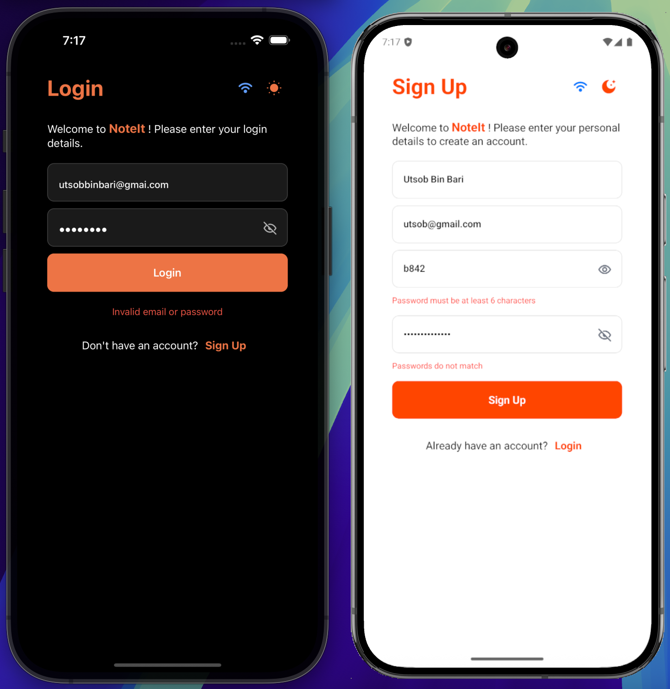
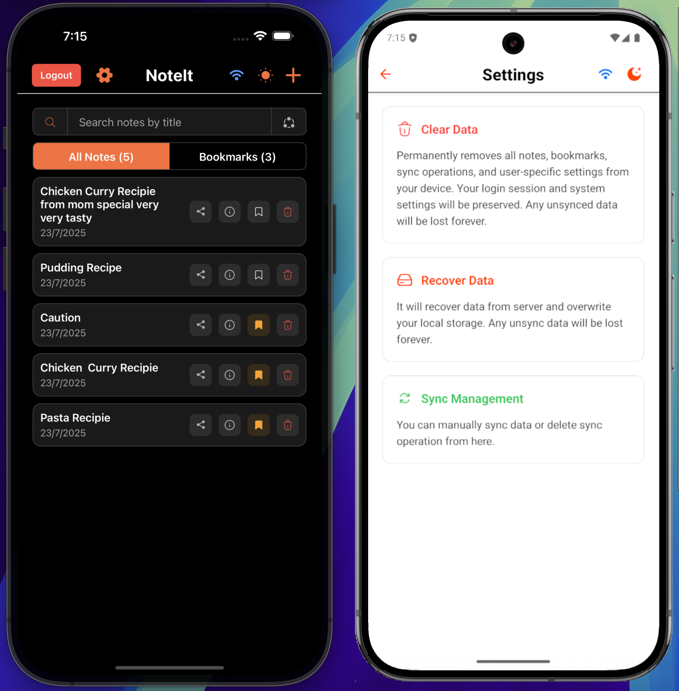

# NoteIt - React Native Note-Taking App

A professional React Native application built with TypeScript for note-taking functionality with **offline-first capabilities**, SQLite database storage, note sharing, and automated data recovery.

## 📱 Features

### ✅ Core Functionality
- **Complete CRUD Operations** - Create, read, update, and delete notes
- **Offline-First Architecture** - Works seamlessly without internet connection
- **Real-Time Search** - Search notes by title with instant filtering
- **Note Sharing** - Share notes via email with other users
- **Bookmark Management** - Save important notes for quick access
- **Auto-Sync** - Automatic synchronization when online
- **Data Recovery** - Complete data restoration from server

### ✅ User Experience
- **Authentication System** - Secure login/signup with auto-login
- **Dark/Light Themes** - Instant theme switching with visual icons
- **Network Status** - Real-time connectivity indicators
- **Responsive Design** - Optimized for all screen sizes
- **Pull-to-Refresh** - Manual refresh functionality
- **Settings Management** - Data clearing and sync management

### ✅ Technical Excellence
- **SQLite Database** - Local storage with sync queue management
- **Redux State Management** - Centralized state with optimistic updates
- **Clean Architecture** - Layered design for maintainability
- **TypeScript** - Full type safety and IntelliSense support
- **Performance Optimized** - FlashList for large datasets

## 📸 App Screenshots

### Authentication & Main Features
<div align="center">
  
| Authentication Screen | App Features |
|----------------------|--------------|
|  |  |

</div>

*Screenshots showing the clean authentication interface and main app functionality including note management, search, sharing, and theme support.*

## 📋 Prerequisites

Before you begin, ensure you have the following installed:

### Required Software
- **Node.js** (v18 or higher) - [Download](https://nodejs.org/)
- **Yarn** (v1.22.22 or higher) - [Install Guide](https://classic.yarnpkg.com/en/docs/install/)
- **React Native CLI** (v19.0.0 or higher) - [Install Guide](https://reactnative.dev/docs/environment-setup)
- **Java Development Kit (JDK)** (v17 or higher) - [Download](https://adoptium.net/)
- **Android Studio** (for Android development) - [Download](https://developer.android.com/studio)
- **Xcode** (for iOS development, macOS only) - [Download from App Store](https://apps.apple.com/us/app/xcode/id497799835)
- **CocoaPods** (v1.16.2 or higher) - [Install Guide](https://cocoapods.org/)

## 🚀 Quick Start

### 1. Clone and Install Dependencies

```bash
git clone <repository-url>
cd NoteIt
yarn install
```

### 2. iOS Setup (macOS only)

```bash
yarn pod-start
```

### 3. Android Setup

```bash
yarn clean-android
```

### 4. Run the App

```bash
# Start Metro bundler
yarn start

# Run on Android (new terminal)
yarn android

# Run on iOS (new terminal)
yarn ios
```

## 🛠️ Available Scripts

| Script | Description |
|--------|-------------|
| `yarn start` | Start Metro bundler |
| `yarn android` | Run on Android device/emulator |
| `yarn ios` | Run on iOS simulator |
| `yarn open` | Open iOS project in Xcode |
| `yarn lint` | Run ESLint for code quality |
| `yarn test` | Run Jest tests |
| `yarn clean-android` | Clean Android build |
| `yarn clean-ios` | Clean iOS build and reinstall pods |
| `yarn pod-start` | Install Ruby dependencies and pods |
| `yarn pod-install` | Install CocoaPods dependencies |

## 📱 Project Information

- **React Native Version**: 0.80.1
- **React Version**: 19.1.0  
- **TypeScript**: 5.0.4
- **Platforms**: iOS, Android
- **Package Manager**: Yarn
- **Architecture**: Clean Architecture with Layered Design
- **Database**: SQLite with offline-first sync capabilities

## 📦 Core Dependencies

### Navigation & UI Framework
- **@react-navigation/native** (v7.1.14) - Core navigation library
- **@react-navigation/stack** (v7.4.2) - Stack navigator for screen transitions
- **react-native-screens** (v4.13.1) - Native navigation optimization
- **react-native-safe-area-context** (v5.5.2) - Safe area handling
- **react-native-gesture-handler** (v2.27.1) - Native gesture handling
- **@react-native-masked-view/masked-view** (v0.3.2) - UI masking for transitions

### State Management & Data Flow  
- **@reduxjs/toolkit** (v2.8.2) - Modern Redux with simplified setup
- **react-redux** (v9.2.0) - React bindings for Redux state management

### Performance & UI Components
- **@shopify/flash-list** (v1.8.3) - High-performance list component
- **react-native-svg** (v15.12.0) - SVG support for custom icons

### Network & API Communication
- **axios** (v1.10.0) - HTTP client for API requests with interceptors
- **@react-native-community/netinfo** (v11.4.1) - Network connectivity monitoring

### Local Storage & Database
- **react-native-sqlite-storage** (v6.0.1) - SQLite database with offline-first capabilities

### Conflict Resolution & Data Synchronization
- **diff-match-patch** (v1.0.5) - Google's algorithm for text comparison and merging

## 🏗️ Project Architecture

This project follows **Clean Architecture** principles with a layered design for maintainability, testability, and scalability.

### Folder Structure

```
src/
├── domain/                   # Business logic layer (innermost)
│   ├── entities/             # Core business entities
│   ├── validators/           # Domain-specific validation rules
│   ├── data/                 # Domain data models
│   └── types/                # TypeScript type definitions
│       ├── auth/             # Authentication types
│       ├── notes/            # Note-related types
│       ├── bookmarks/        # Bookmark types
│       ├── store/            # Redux state types
│       ├── theme/            # Theme types
│       └── user/             # User types
│
├── application/              # Application logic layer (middle)
│   ├── store/                # Redux store configuration
│   │   ├── action/           # Redux actions (auth, notes, bookmarks)
│   │   ├── reducer/          # Redux reducers
│   │   ├── initialState.ts   # Initial state definitions
│   │   └── store.ts          # Store configuration
│   ├── services/             # Business logic services (functional)
│   │   ├── auth/             # Authentication services
│   │   ├── notes/            # Note management services
│   │   ├── bookmarks/        # Bookmark services
│   │   ├── data/             # Data management services
│   │   ├── user/             # User services
│   │   └── RecoveryService.ts # Data recovery service
│   ├── context/              # React context providers
│   │   └── AppContext.tsx    # Theme management
│   └── utils/                # Application utilities
│
├── infrastructure/           # External concerns layer
│   ├── storage/              # Database and local storage
│   │   ├── DatabaseSchema.ts # SQLite schema definitions
│   │   ├── DatabaseInit.ts   # Database initialization
│   │   └── userSessionStorage.ts # Session storage
│   ├── api/                  # HTTP client and API communication
│   │   ├── config/           # API configuration
│   │   ├── endpoints/        # API endpoint definitions
│   │   ├── requests/         # API calling functions
│   │   ├── hooks/            # API utility hooks
│   │   └── interceptor/      # Request/response interceptors
│   ├── validation/           # Infrastructure-level validation
│   └── utils/                # Infrastructure utilities
│       └── NetworkService.ts # Network connectivity management
│
└── presentation/             # UI layer (outermost)
    ├── screens/              # Screen components
    │   ├── LoginScreen.tsx   # Authentication screen
    │   ├── SignUpScreen.tsx  # Registration screen
    │   ├── HomeScreen.tsx    # Main notes list screen
    │   ├── NoteScreen.tsx    # Note editing screen
    │   ├── SettingsScreen.tsx # Settings and sync management
    │   └── SyncManagementScreen.tsx # Advanced sync controls
    ├── components/           # Reusable UI components
    │   ├── AllNotesComponent.tsx # Notes list with search/share
    │   ├── AllBookmarksComponent.tsx # Bookmarks list
    │   ├── CustomTextInput.tsx # Theme-aware text input
    │   ├── CustomButton.tsx  # Configurable button
    │   ├── SearchInput.tsx   # Search input with filter
    │   ├── ShareInput.tsx    # Note sharing input
    │   ├── SharedUsersDisplay.tsx # Shared users display
    │   ├── SyncStatusIcon.tsx # Sync status indicator
    │   ├── ToggleSwitch.tsx  # Toggle between views
    │   └── icons/            # Custom SVG icon components
    ├── navigation/           # Navigation configuration
    │   ├── stacks/           # Stack navigator setup
    │   └── types/            # Navigation type definitions
    ├── hooks/                # Custom React hooks
    │   ├── useLogin.ts       # Login form management
    │   ├── useSignup.ts      # Signup form management
    │   ├── useHome.ts        # Home screen logic
    │   ├── useNoteEditor.ts  # Note editing logic
    │   ├── useSettings.ts    # Settings management
    │   ├── useAllNotes.ts    # Notes list management
    │   ├── useAllBookmarks.ts # Bookmarks management
    │   ├── useRecovery.ts    # Data recovery management
    │   ├── useSyncManagement.ts # Sync controls
    │   ├── useSyncStatus.ts  # Sync status monitoring
    │   ├── useNetworkStatus.ts # Network connectivity
    │   └── useAppInitialization.ts # App startup logic
    ├── styles/               # Styling and theming
    │   ├── GlobalStyles.ts   # Global application styles
    │   └── CustomHeaderStyle.ts # Navigation header styling
    ├── utils/                # Presentation utilities
    └── constants/            # UI constants
        └── Colors.tsx        # Color definitions for theming
```

### Architecture Benefits

- **✅ Separation of Concerns**: Each layer has specific responsibilities
- **✅ Testability**: Each layer can be tested independently
- **✅ Maintainability**: Clear boundaries make code easier to maintain
- **✅ Scalability**: Easy to add new features without affecting existing code
- **✅ Dependency Rule**: Inner layers don't depend on outer layers
- **✅ Offline-First**: Complete offline functionality with automatic sync

## 🎨 User Interface Features

### Authentication Screens
- **LoginScreen**: Email/password authentication with validation
- **SignUpScreen**: User registration with password confirmation
- **Auto-Login**: Automatic session restoration on app startup
- **Form Validation**: Real-time email and password validation
- **Password Visibility**: SVG eye icons for password toggle

### Main Application Screens
- **HomeScreen**: Notes dashboard with search and filtering
- **NoteScreen**: Rich text note editing with auto-save
- **SettingsScreen**: Data management and sync controls
- **SyncManagementScreen**: Advanced synchronization options

### UI Components & Icons
- **Custom SVG Icons**: Theme-aware scalable icons
  - **SearchIcon**: Search functionality indicator
  - **ShareIcon**: Note sharing controls
  - **InfoIcon**: Shared users information
  - **FilterIcon**: Search filtering toggle
  - **BookmarkIcon**: Save/unsave notes
  - **BinIcon**: Delete operations
  - **SyncIcon**: Synchronization status
  - **CheckIcon**: Success confirmations
  - **EyeIcon/EyeOffIcon**: Password visibility
  - **SunIcon/MoonIcon**: Theme switching
  - **WiFiOnlineIcon/WiFiOfflineIcon**: Network status
  - **HardDriveIcon**: Local storage operations

### Theme System
- **Dynamic Theming**: Instant light/dark mode switching
- **Visual Theme Toggle**: Sun/Moon icons for intuitive switching
- **Context-Based**: Theme state managed through React Context
- **Adaptive Colors**: All components adapt to current theme
- **Network Status Colors**: Blue (connected) / Grey (offline)

## 💾 Database & Offline Features

### SQLite Implementation
- **Complete Offline Functionality**: All operations work without internet
- **Sync Queue Management**: Operations queued for online synchronization
- **Conflict Resolution**: Built-in conflict detection and resolution
- **Data Persistence**: Proper schema design with relationships

### Database Tables
- **user_session**: Current user authentication and tokens
- **notes**: Main notes with sharing and bookmark support
- **users**: Cached user data for sharing functionality
- **sync_queue**: Pending operations for online sync
- **app_settings**: Configuration and sync metadata

### Data Recovery System
- **Automatic Detection**: Detects database corruption and reinstall scenarios
- **Complete Recovery**: Restores all data types from backend
  - User's own notes and content
  - Notes shared with user by others
  - User's bookmarked notes
  - User profile and session data
- **Visual Progress**: Step-by-step recovery indicators
- **User Control**: Option to restore or skip recovery

## 🌐 Network & API Features

### HTTP Client Architecture
- **Centralized Configuration**: Base URL and timeout settings
- **Type-Safe Requests**: TypeScript interfaces for all API calls
- **Error Handling**: Global error handling for consistent UX
- **Authentication**: Automatic 401 detection and session management

### Real-Time Network Monitoring
- **Live Connectivity**: Real-time network state detection
- **Visual Indicators**: Custom WiFi icons showing connection status
- **Automatic Updates**: Instant icon changes on network state changes
- **Universal Coverage**: Network status visible on all screens

## 🔄 Synchronization Features

### Sync Management
- **Smart Sync**: Only syncs changed data for efficiency
- **Automatic Retry**: Failed operations automatically retried
- **Manual Controls**: User-initiated sync from settings
- **Sync Status**: Visual indicators for sync progress
- **Queue Management**: Advanced sync queue controls

### Conflict Resolution
- **Intelligent Merging**: Uses diff-match-patch for text conflicts
- **User Resolution**: Options for handling merge conflicts
- **Backup Strategy**: Original data preserved during conflicts

## 🔧 Development

### Making Changes

1. The app uses Fast Refresh for immediate updates
2. For full reload:
   - **Android**: Press `R` twice or use Dev Menu (`Ctrl+M`)
   - **iOS**: Press `R` in iOS Simulator

### Code Standards

- **Layered Architecture**: Follow clean architecture principles
- **TypeScript**: Use strict typing with proper interfaces
- **Functional Services**: Use functional programming patterns
- **Component Reusability**: Extend existing components before creating new ones
- **Theme Consistency**: Use GlobalStyles and color constants

## 🐛 Troubleshooting

### Common Issues

1. **Metro bundler issues**: `yarn start --reset-cache`
2. **iOS build issues**: `yarn clean-ios`
3. **Android build issues**: `yarn clean-android`
4. **Dependency issues**: Delete `node_modules`, run `yarn install`
5. **SQLite issues**: Check device storage and permissions
6. **Sync conflicts**: App handles automatically with user options

### Environment Issues

For environment setup problems, refer to:
- [React Native Documentation](https://reactnative.dev/docs/environment-setup)
- [Troubleshooting Guide](https://reactnative.dev/docs/troubleshooting)

## 📚 Learn More

- [React Native Documentation](https://reactnative.dev/docs/getting-started)
- [React Navigation](https://reactnavigation.org/docs/getting-started)
- [Redux Toolkit](https://redux-toolkit.js.org/introduction/getting-started)
- [Clean Architecture](https://blog.cleancoder.com/uncle-bob/2012/08/13/the-clean-architecture.html)
- [React Native SVG](https://github.com/react-native-svg/react-native-svg)
- [SQLite Storage](https://github.com/andpor/react-native-sqlite-storage)

## 🤝 Contributing

1. Fork the repository
2. Create a feature branch
3. Follow the layered architecture pattern
4. Run tests: `yarn test`
5. Run linting: `yarn lint`
6. Submit a pull request

---

**Note**: This project requires Node.js version 18 or higher as specified in the `package.json` engines field.
